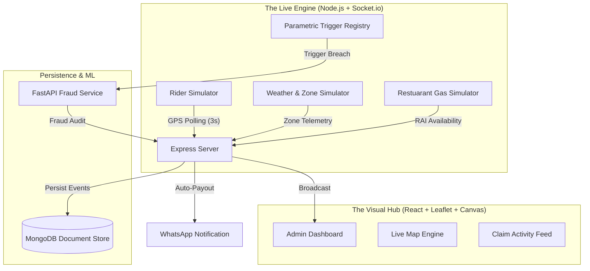

# GigShield: Live Visual Platform Architecture (v5.0)

GigShield is a distributed, real-time parametric insurance orchestration layer. Version 5.0 introduces "High-Fidelity Visual Monitoring" and "Localized Risk Simulation" for the Andhra Pradesh delivery network.

## 🏗️ v5.0 System Interaction

## 🔐 Core Technological Pillars

### 1. High-Fidelity Simulation (The "Live" Backend)
Unlike static prototypes, GigShield v5.0 runs **four parallel simulation services**:
- **Rider Movement**: 10 distinct entities moving along interpolated GPS paths across Vizag, Vijayawada, and Anantapur.
- **Gradual Weather**: Environmental states (Rain, Temp, AQI) shift gradually, allowing for "Watch" and "Warning" phases before a payout trigger.
- **Gas/LPG Crisis**: Simulates restaurant-side disruptions (RAI - Restaurant Availability Index) that impact worker earnings without rain.

### 2. Canvas-Accelerated Visuals (The Frontend)
To provide an "Enterprise Control Center" feel, the frontend utilizes:
- **Leaflet Integration**: Dark-tiled vector maps with interactive AP zone polygons.
- **HTML5 Canvas**: A dedicated animation layer for falling rain and heat shimmer, ensuring 60fps performance during heavy weather events.
- **Pulsed Markers**: CSS-animated markers that visually flag worker status (Safe, Claiming, Paid).

### 3. Agile Document Store (MongoDB)
Transitioned from SQL to NoSQL in v5.0 to handle unstructured telemetry and flexible claim metadata:
- **Telemetry History**: Storing minute-by-minute weather samples for all 8 AP zones.
- **Claim Evidence**: Mapping ML risk factors to specific trigger events for audit transparency.

## 📊 The "Nanna Promise" Data Loop
1. **Sensory Detection**: Rain Simulator pushes 22mm/hr to the `Engine`.
2. **Visual Broadcast**: Frontend Map switches to `rain` mode; Canvas rain animation begins.
3. **Trigger Evaluation**: `Engine` identifies all workers with `active` coverage in the impacted zone.
4. **Fraud Verification**: ML Service checks worker velocity (making sure they are actually delivering, not gaming the system).
5. **Instant Settlement**: Backend emits `payout_processed`; Worker's UI increments the counter; WhatsApp sends the alert.

---
**GigShield: Engineering Trust in the Gig Economy.**
